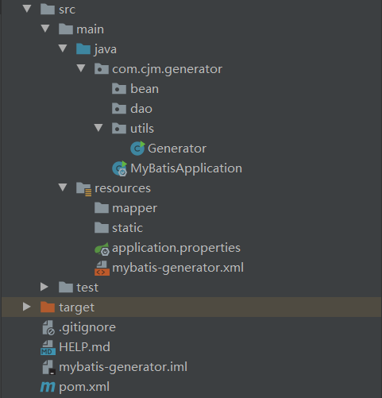
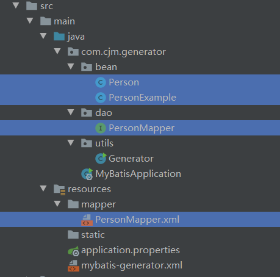

# SpringBoot学习笔记（七）：Mybatis-Generator代码自动生成

- 项目结构


## 一、pom.xml引入Maven依赖

- **mybatis-generator-core**为主要依赖

```xml
<dependency>
    <groupId>org.springframework.boot</groupId>
    <artifactId>spring-boot-starter-web</artifactId>
</dependency>
<!--jdbc -->
<dependency>
    <groupId>org.springframework.boot</groupId>
    <artifactId>spring-boot-starter-jdbc</artifactId>
    <version>2.3.4.RELEASE</version>
</dependency>
<!-- 默认集成的版本是8.x，注意mysql记得引入5.x版本 -->
<dependency>
    <groupId>mysql</groupId>
    <artifactId>mysql-connector-java</artifactId>
    <version>5.1.46</version>
    <scope>runtime</scope>
</dependency>
<!-- mybatis -->
<dependency>
    <groupId>org.mybatis.spring.boot</groupId>
    <artifactId>mybatis-spring-boot-starter</artifactId>
    <version>2.1.3</version>
</dependency>
<!-- generator -->
<dependency>
    <groupId>org.mybatis.generator</groupId>
    <artifactId>mybatis-generator-core</artifactId>
    <version>1.4.0</version>
</dependency>
```

## 二、application.properties配置

- 配置数据库
  - `serverTimezone=UTC`：设定时区，会比中国时间早8个小时。可以使用**serverTimezone=Asia/Shanghai**或**serverTimezone=GMT%2B8**，此处**%2B**经过URL编码后的结果，原来是GMT+8, 加号在URL中必须被编码，成了%2B。
    - [HTML URL编码参考](https://www.w3schools.com/tags/ref_urlencode.ASP)
  - `com.mysql.jdbc.Driver` 是 mysql-connector-java 5中的，`com.mysql.cj.jdbc.Driver` 是 mysql-connector-java 6以上的版本中的。**注意别依赖版本别引错。**

```properties
#数据源
spring.datasource.driver-class-name=com.mysql.jdbc.Driver
spring.datasource.url=jdbc:mysql://127.0.0.1:3306/first?useUnicode=true&characterEncoding=UTF-8&serverTimezone=UTC
spring.datasource.username=root
spring.datasource.password=123456
#整合mybatis,mapper映射xml路径
mybatis.mapper-locations=classpath:/mapper/**.xml
```

## 三、mybatis-generator.xml

```xml
<?xml version="1.0" encoding="UTF-8"?>
<!DOCTYPE generatorConfiguration
        PUBLIC "-//mybatis.org//DTD MyBatis Generator Configuration 1.0//EN"
        "http://mybatis.org/dtd/mybatis-generator-config_1_0.dtd">
<!-- 配置生成器 -->
<generatorConfiguration>

    <!-- mysql-connector-java-5.1.46.jar的绝对路径 -->
    <classPathEntry location="D:/Program Files/apache-maven-3.6.3/respository/mysql/mysql-connector-java/5.1.46/mysql-connector-java-5.1.46.jar" />

    <!-- 一个数据库一个context -->
    <context id="DB2Tables" targetRuntime="MyBatis3">
        <!-- 自动识别数据库关键字，默认false，如果设置为true，根据SqlReservedWords中定义的关键字列表；
                一般保留默认值，遇到数据库关键字（Java关键字），使用columnOverride覆盖 -->
        <property name="autoDelimitKeywords" value="true" />
        <!-- 生成的Java文件的编码 -->
        <property name="javaFileEncoding" value="utf-8" />
        <!-- 格式化java代码 -->
        <property name="javaFormatter" value="org.mybatis.generator.api.dom.DefaultJavaFormatter"/>
        <!-- 格式化XML代码 -->
        <property name="xmlFormatter" value="org.mybatis.generator.api.dom.DefaultXmlFormatter"/>
        <!-- beginningDelimiter和endingDelimiter：指明数据库的用于标记数据库对象名的符号，比如ORACLE就是双引号，MYSQL默认是`反引号； -->
        <property name="beginningDelimiter" value="`"/>
        <property name="endingDelimiter" value="`"/>

        <!-- 注释 -->
        <commentGenerator >
            <property name="suppressAllComments" value="true"/><!-- 是否取消注释 -->
            <property name="suppressDate" value="true" /> <!-- 是否生成注释代时间戳-->
        </commentGenerator>
        <!-- 配置数据源 -->
        <jdbcConnection driverClass="com.mysql.jdbc.Driver"
                        connectionURL="jdbc:mysql://localhost:3306/first"
                        userId="root"
                        password="123456">
            <!-- 这里面可以设置property属性，每一个property属性都设置到配置的Driver上 -->
        </jdbcConnection>
        <!-- 类型转换 -->
        <javaTypeResolver >
            <!-- 是否使用bigDecimal， false可自动转化以下类型（Long, Integer, Short, etc.） -->
            <property name="forceBigDecimals" value="false" />
        </javaTypeResolver>

        <!-- 配置生成的javabean所存放的路径和包（使用绝对路径） -->
        <javaModelGenerator targetPackage="com.cjm.mybatis.bean" targetProject="D:\Maven\mybatis-generator\src\main\java">
            <!-- 在targetPackage的基础上，根据数据库的schema再生成一层package，最终生成的类放在这个package下，默认为false -->
            <property name="enableSubPackages" value="true" />
            <property name="trimStrings" value="true" />
        </javaModelGenerator>

        <!-- 配置生成的**Mapper.xml文件所存放的路径和包（使用绝对路径） -->
        <sqlMapGenerator targetPackage="mapper"  targetProject="D:\Maven\mybatis-generator\src\main\resources">
            <property name="enableSubPackages" value="true" />
        </sqlMapGenerator>

        <!-- 配置生成的**Mapper.java接口文件所存放的路径和包（使用绝对路径） -->
        <javaClientGenerator type="XMLMAPPER" targetPackage="com.cjm.mybatis.dao"  targetProject="D:\Maven\mybatis-generator\src\main\java">
            <property name="enableSubPackages" value="true" />
        </javaClientGenerator>

        <!-- 指定我们要操作的表明和生成的javabean类名 -->
        <table tableName="person" domainObjectName="Person" >
        </table>

    </context>
</generatorConfiguration>
```

## 四、创建主文件Generator.java

- 创建一个utils包，新建一个类Generator.java，用于自动生成实体类、mapper接口和映射数据库的xml文件。

```java
public class Generator {
    public static void main(String[] args) throws Exception {
        List<String> warnings=new ArrayList<String>();
        boolean overwrite=true;
        File configFile=new File("D:/Maven/mybatis-generator/src/main/resources/mybatis-generator.xml");
        ConfigurationParser cp=new ConfigurationParser(warnings);
        Configuration config=cp.parseConfiguration(configFile); //IOException, XMLParserException
        DefaultShellCallback callback=new DefaultShellCallback(overwrite);
        MyBatisGenerator myBatisGenerator=new MyBatisGenerator(config,callback,warnings);//InvalidConfigurationException
        myBatisGenerator.generate(null);  // SQLException, InterruptedException
    }
}
```

## 五、运行结果



`注意`：如果bean、dao、mapper包都没有创建也可以，只要设置了在mybatis-generator.xml配置`<property name="enableSubPackages" value="true" />`就会自动创建。